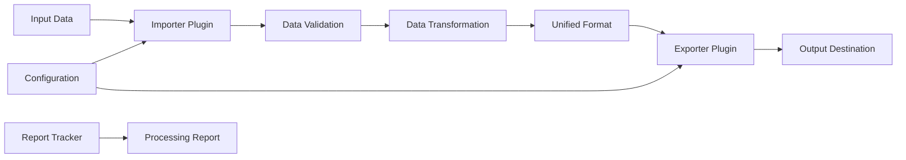

# Mass Import Plugin System

A modular, extensible data import and export system for the Cultural Archiver project. This system provides a plugin-based architecture for importing public art data from various sources and exporting it to different formats and destinations.

## 🎯 Overview

The Mass Import Plugin System is designed to replace the original hardcoded import system with a flexible, modular architecture that supports:

- **Plugin-based Architecture**: Easily add new importers and exporters without modifying core code
- **Type-safe Development**: Full TypeScript support with strict type checking
- **Unified Data Pipeline**: Consistent data transformation flow from any source to any destination
- **CLI Interface**: Modern command-line interface with plugin discovery and validation
- **Error Handling**: Comprehensive error tracking and reporting
- **Testing Framework**: Built-in testing tools and utilities

## 🏗️ Architecture

```text
mass-import-system/
├── 📦 Core System
│   ├── lib/               # Core library components
│   │   ├── plugin-registry.ts    # Plugin registration and management
│   │   ├── data-pipeline.ts      # Data processing pipeline
│   │   └── report-tracker.ts     # Processing reports and analytics
│   └── types/             # TypeScript type definitions
│       ├── plugin.ts      # Plugin interface definitions
│       └── index.ts       # Shared data types
│
├── 🔌 Plugins
│   ├── importers/         # Data source plugins
│   │   ├── vancouver-public-art.ts   # Vancouver Open Data
│   │   └── osm-artwork.ts            # OpenStreetMap artwork
│   └── exporters/         # Data destination plugins
│       ├── json-exporter.ts          # JSON file export
│       ├── console-exporter.ts       # Console output
│       └── api-exporter.ts           # REST API export
│
├── 🖥️ CLI Interface
│   ├── cli/               # Command-line interface
│   │   ├── plugin-cli.ts  # Modern plugin-aware CLI
│   │   └── index.ts       # Legacy CLI (compatibility)
│   └── cli.ts             # CLI entry point
│
├── 🧪 Development Tools
│   ├── templates/         # Plugin templates
│   ├── test/             # Test suite
│   └── create-plugin.js  # Plugin generator script
│
└── 📋 Documentation
    ├── README.md         # This file
    └── TESTING.md        # Testing guide
```

## 🚀 Quick Start

### Installation

```bash
cd src/lib/mass-import-system
npm install
npm run build
```

### Basic Usage

#### OSM

```
node dist/cli/cli-entry.js import --importer osm-artwork --generate-report --input C:\Users\funvill\Documents\git\cultural-archiver\src\lib\data-collection\osm\output\merged\merged-artworks.geojson --output processed-art.json --exporter api --config api-config-dev.json
```

#### Vancouver open data

```
node dist/cli/cli-entry.js import --importer vancouver-public-art --generate-report --input C:\Users\funvill\Documents\git\cultural-archiver\src\lib\mass-import-system\importers\public-art.json --output processed-art.json --exporter api --config api-config-dev.json
```

#### List Available Plugins

```bash
node dist/cli/cli-entry.js list-plugins
```

#### Import Data

```bash
# Import Vancouver public art data and export to JSON
node dist/cli/cli-entry.js import \
  --importer vancouver-public-art \
  --exporter json \
  --input example-vancouver-data.json \
  --output processed-art.json

# Import test data and display in console
node dist/cli/cli-entry.js import \
  --importer vancouver-public-art \
  --exporter console \
  --input example-vancouver-data.json \
  --config test-config.json

# Process only first 10 records for testing
node dist/cli/cli-entry.js import \
  --importer vancouver-public-art \
  --exporter json \
  --input example-vancouver-data.json \
  --output sample.json \
  --limit 10

# Skip first 100 records and process next 50 (pagination)
node dist/cli/cli-entry.js import \
  --importer vancouver-public-art \
  --exporter json \
  --input example-vancouver-data.json \
  --output batch2.json \
  --offset 100 \
  --limit 50
```

#### Import to Database

The system includes an `api` exporter that can import data directly into the Cultural Archiver database via the mass-import API endpoints.

**Development Database Import:**

```bash
# Import to local development database (localhost:8787)
node dist/cli/cli-entry.js import \
  --importer vancouver-public-art \
  --exporter api \
  --input importers/public-art.json \
  --config api-config.json \
  --limit 10

# Import with custom development configuration
node dist/cli/cli-entry.js import \
  --importer vancouver-public-art \
  --exporter api \
  --input importers/public-art.json \
  --config '{"exporter":{"apiEndpoint":"http://localhost:8787/api/mass-import/v2","authentication":{"type":"bearer","token":"test-admin-token"}}}' \
  --limit 5

# Test import with dry-run (validate without importing)
node dist/cli/cli-entry.js import \
  --importer vancouver-public-art \
  --exporter api \
  --input importers/public-art.json \
  --config api-config.json \
  --limit 3 \
  --dry-run
```

**Production Database Import:**

```bash
# Import to production database (api.publicartregistry.com)
node dist/cli/cli-entry.js import \
  --importer vancouver-public-art \
  --exporter api \
  --input importers/public-art.json \
  --config '{"exporter":{"apiEndpoint":"https://api.publicartregistry.com/api/mass-import/v2","authentication":{"type":"bearer","token":"your-production-admin-token"},"timeout":60000,"retryAttempts":3}}' \
  --limit 50

# Production import with verbose logging
node dist/cli/cli-entry.js import \
  --importer vancouver-public-art \
  --exporter api \
  --input importers/public-art.json \
  --config production-api-config.json \
  --verbose \
  --generate-report
```

**Configuration Files for Database Import:**

Create environment-specific configuration files:

_api-config.json_ (Development):

```json
{
  "exporter": {
    "apiEndpoint": "http://localhost:8787/api/mass-import/v2",
    "method": "POST",
    "headers": {
      "Content-Type": "application/json"
    },
    "authentication": {
      "type": "bearer",
      "token": "test-admin-token"
    },
    "timeout": 30000,
    "retryAttempts": 3,
    "retryDelay": 1000,
    "validateResponse": true,
    "logRequests": true,
    "logResponses": true
  }
}
```

_production-api-config.json_ (Production):

```json
{
  "exporter": {
    "apiEndpoint": "https://api.publicartregistry.com/api/mass-import/v2",
    "method": "POST",
    "headers": {
      "Content-Type": "application/json"
    },
    "authentication": {
      "type": "bearer",
      "token": "system-admin-mass-import-token"
    },
    "timeout": 60000,
    "retryAttempts": 5,
    "retryDelay": 2000,
    "validateResponse": true,
    "logRequests": false,
    "logResponses": false
  }
}
```

**Prerequisites for Database Import:**

1. **Development Environment**: Ensure the development server is running:

   ```bash
   npm run dev  # Starts frontend and backend on localhost:8787
   ```

2. **Production Environment**: Requires valid admin authentication token for `api.publicartregistry.com`

3. **Authentication**: The mass-import API requires admin-level bearer tokens:
   - Development: `test-admin-token` (configured in local environment)
   - Production: `system-admin-mass-import-token` (secure production token)

4. **Rate Limits**: The API has built-in rate limiting and batch processing. Use smaller batch sizes for initial testing.

#### Plugin Information

```bash
# Get detailed information about a plugin
node dist/cli/cli-entry.js plugin-info --name vancouver-public-art
```

### Programmatic Usage

```typescript
import { PluginRegistry, DataPipeline } from './dist/index.js';
import { registerCoreImporters } from './dist/importers/index.js';
import { registerCoreExporters } from './dist/exporters/index.js';

// Initialize the plugin system
const registry = new PluginRegistry();
registerCoreImporters(registry);
registerCoreExporters(registry);

// Create a data pipeline
const importer = registry.getImporter('vancouver-public-art');
const exporter = registry.getExporter('json');
const pipeline = new DataPipeline(importer, exporter);

// Process data
const result = await pipeline.process(inputData, {
  batchSize: 50,
  generateReport: true,
  outputPath: './output.json',
});
```

## 🔌 Available Plugins

### Importers

| Plugin                 | Description                            | Version | Data Source |
| ---------------------- | -------------------------------------- | ------- | ----------- |
| `vancouver-public-art` | Vancouver Open Data public art dataset | 1.0.0   | JSON API    |
| `osm-artwork`          | OpenStreetMap artwork and monuments    | 1.0.0   | GeoJSON     |

### Exporters

| Plugin    | Description                                   | Version | Output Type |
| --------- | --------------------------------------------- | ------- | ----------- |
| `json`    | JSON file export with configurable formatting | 1.0.0   | File        |
| `console` | Console output with table/JSON formatting     | 1.0.0   | Console     |
| `api`     | REST API export to Cultural Archiver database | 1.0.0   | HTTP API    |

## 🛠️ Plugin Development

### Creating a New Importer

1. **Use the Template Generator**:

   ```bash
   node create-plugin.js --type importer --name my-data-source
   ```

2. **Manual Creation**:

   ```bash
   cp templates/importer/importer-template.ts importers/my-importer.ts
   ```

3. **Implement Required Methods**:

   ```typescript
   export const myImporter: ImporterPlugin = {
     name: 'my-data-source',
     metadata: {
       version: '1.0.0',
       description: 'Imports data from my custom source',
       author: 'Your Name',
     },

     async validateData(data: unknown): Promise<ValidationResult> {
       // Validate input data structure
     },

     async mapData(data: unknown, config: ImporterConfig): Promise<UnifiedArtwork[]> {
       // Transform data to unified format
     },
   };
   ```

4. **Register the Plugin**:

   ```typescript
   // In importers/index.ts
   import { myImporter } from './my-importer.js';

   export function registerCoreImporters(registry: PluginRegistry): void {
     registry.registerImporter(myImporter);
     // ... other registrations
   }
   ```

### Creating a New Exporter

1. **Use the Template Generator**:

   ```bash
   node create-plugin.js --type exporter --name my-destination
   ```

2. **Implement Required Methods**:

   ```typescript
   export const myExporter: ExporterPlugin = {
     name: 'my-destination',
     metadata: {
       version: '1.0.0',
       description: 'Exports data to my custom destination',
       author: 'Your Name',
     },

     async configure(options: Record<string, unknown>): Promise<void> {
       // Configure exporter
     },

     async exportData(data: UnifiedArtwork[], config: ExporterConfig): Promise<ExportResult> {
       // Export data to destination
     },
   };
   ```

## 📝 Configuration

### Importer Configuration

Each importer can have its own configuration file:

```json
{
  "vancouver-public-art": {
    "apiEndpoint": "https://opendata.vancouver.ca/api/records/1.0/search/",
    "dataset": "public-art",
    "fieldMappings": {
      "title": "title_of_work",
      "artist": "artist",
      "location": "civic_address"
    }
  }
}
```

### Exporter Configuration

Exporters support various configuration options:

```json
{
  "json": {
    "format": "pretty",
    "includeMetadata": true,
    "batchSize": 100
  },
  "api": {
    "endpoint": "https://api.publicartregistry.com/submissions",
    "authentication": {
      "type": "bearer",
      "token": "your-api-token"
    },
    "batchSize": 50,
    "retryAttempts": 3
  }
}
```

## 🗺️ Location Enhancement

The mass import system includes automatic location enhancement that enriches artwork records with human-readable location names using reverse geocoding. This feature uses a local SQLite cache with fallback to the Nominatim (OpenStreetMap) API.

### Features

- **Cache-first Strategy**: Checks local database before making API requests
- **Rate Limiting**: Respects Nominatim's 1 request/second limit
- **Resumable Processing**: Can be interrupted and resumed without re-fetching
- **Structured Data**: Stores detailed address components (city, state, country, etc.)
- **Automatic Integration**: Works seamlessly with existing import pipelines

### Quick Start

#### 1. Pre-warm the Location Cache

Before running large imports, warm the cache with your data to avoid API delays:

```bash
# Warm cache with OSM data
npm run warm-location-cache src/lib/data-collection/osm-vancouver-art.json

# Warm cache with Vancouver Public Art data
npm run warm-location-cache src/lib/data-collection/vancouver-public-art.json

# Warm cache with custom data file
npm run warm-location-cache path/to/your/data.json
```

#### 2. Enable Location Enhancement in Imports

Location enhancement is enabled by default but can be configured:

**Basic Usage (CLI):**

```bash
# Location enhancement enabled by default
npm run mass-import -- osm json example-vancouver-data.json --out processed-art.json

# Disable location enhancement
npm run mass-import -- osm json example-vancouver-data.json --out processed-art.json --no-location-enhancement
```

**Programmatic Usage:**

```typescript
import { DataPipeline } from './lib/data-pipeline.js';

const pipeline = new DataPipeline(importer, exporter);

const result = await pipeline.process(inputData, {
  locationEnhancement: {
    enabled: true,
    failOnErrors: false,
    tagFields: {
      displayName: 'location_display_name',
      city: 'location_city',
      country: 'location_country',
      state: 'location_state',
    },
  },
});
```

### Configuration Options

```typescript
interface LocationEnhancementOptions {
  enabled?: boolean; // Enable/disable enhancement (default: true)
  cacheDbPath?: string; // Custom cache database path
  requestTimeout?: number; // API timeout in ms (default: 10000)
  failOnErrors?: boolean; // Fail on lookup errors (default: false)
  tagFields?: {
    // Custom tag field names
    displayName?: string; // Field for full address
    country?: string; // Field for country
    state?: string; // Field for state/province
    city?: string; // Field for city
    suburb?: string; // Field for suburb
    neighbourhood?: string; // Field for neighbourhood
  };
}
```

### Cache Management

**Check Cache Statistics:**

```bash
npm run location-cache:stats
```

**Cache Performance:**

- Cache hits: < 1ms response time
- API requests: ~500ms + 1 second rate limit delay
- Database size: ~1KB per cached location

### Data Enhancement

Location enhancement adds the following fields to artwork records:

```json
{
  "lat": 49.2827,
  "lon": -123.1207,
  "title": "Sample Artwork",
  "tags": {
    "location_display_name": "Downtown Vancouver, BC, Canada",
    "location_country": "Canada",
    "location_state": "British Columbia",
    "location_city": "Vancouver",
    "location_suburb": "Downtown",
    "material": "bronze",
    "artist": "Example Artist"
  }
}
```

### Performance Estimates

| Dataset Size    | Cache Warming Time |
| --------------- | ------------------ |
| 100 locations   | ~2 minutes         |
| 500 locations   | ~9 minutes         |
| 1,000 locations | ~17 minutes        |
| 5,000 locations | ~1.4 hours         |

### Troubleshooting

**Rate limit exceeded:**

- The system automatically handles rate limiting
- Pre-warm the cache to avoid API calls during imports

**Database locked:**

- Ensure no other processes are accessing the cache
- Check that `_data/location-cache.sqlite` isn't open elsewhere

**Module compilation error:**

```bash
# Rebuild better-sqlite3 for your Node.js version
npm rebuild better-sqlite3
```

For more detailed information, see the [Location Services Documentation](../../location/README.md).

## 🧪 Testing

Run the test suite:

```bash
npm test
```

Run specific tests:

```bash
# Test basic functionality
npm run test:basic

# Test full integration
npm run test:integration
```

For detailed testing information, see [TESTING.md](./TESTING.md).

## 📊 CLI Commands

### Main Commands

| Command           | Description                         | Example                                     |
| ----------------- | ----------------------------------- | ------------------------------------------- |
| `import`          | Import data using specified plugins | `import --importer osm --exporter json`     |
| `list-plugins`    | List all available plugins          | `list-plugins`                              |
| `validate-config` | Validate plugin configuration files | `validate-config --config my-config.json`   |
| `plugin-info`     | Show detailed plugin information    | `plugin-info --plugin vancouver-public-art` |

### Import Command Options

| Option              | Description                                          | Default     |
| ------------------- | ---------------------------------------------------- | ----------- |
| `--importer`        | Importer plugin name                                 | Required    |
| `--exporter`        | Exporter plugin name (use `api` for database import) | Required    |
| `--input`           | Input file path                                      | stdin       |
| `--output`          | Output file path (not used for `api` exporter)       | stdout      |
| `--config`          | Configuration file path or JSON string               | auto-detect |
| `--batch-size`      | Processing batch size                                | 50          |
| `--limit`           | Limit number of records to process                   | unlimited   |
| `--offset`          | Skip first N records before processing               | 0           |
| `--dry-run`         | Validate without processing (test mode)              | false       |
| `--verbose`         | Enable verbose logging                               | false       |
| `--generate-report` | Generate processing report                           | false       |

## 🔄 Data Flow



1. **Input**: Raw data from various sources (JSON, GeoJSON, CSV, etc.)
2. **Validation**: Importer validates data structure and content
3. **Transformation**: Data is mapped to unified `UnifiedArtwork` format
4. **Processing**: Data flows through the pipeline with error handling
5. **Export**: Exporter sends data to destination (file, API, console)
6. **Reporting**: Optional processing reports with statistics and errors

## 🔧 Development

### Building

```bash
npm run build     # Build TypeScript to JavaScript
npm run dev       # Build with watch mode
npm run clean     # Clean build artifacts
```

### Linting

```bash
npm run lint      # Run ESLint
```

### Project Structure

- **Core Library** (`lib/`): Plugin registry, data pipeline, utilities
- **Type Definitions** (`types/`): TypeScript interfaces and types
- **Plugins** (`importers/`, `exporters/`): Plugin implementations
- **CLI** (`cli/`): Command-line interface
- **Templates** (`templates/`): Plugin development templates
- **Tests** (`test/`): Test suites and utilities

## 🤝 Contributing

1. **Create a Plugin**: Use templates to create new importers/exporters
2. **Follow Types**: Use TypeScript interfaces for type safety
3. **Add Tests**: Include tests for new functionality
4. **Update Documentation**: Update README and inline docs
5. **Register Plugins**: Add new plugins to the registration functions

## 📋 Roadmap

- [ ] **More Importers**: Additional data source plugins (Wikidata, government APIs)
- [ ] **Advanced Exporters**: Database exporters, cloud storage integration
- [ ] **Data Validation**: Enhanced validation with schema checking
- [ ] **Performance Optimization**: Streaming processing for large datasets
- [ ] **Plugin Marketplace**: Discoverable plugin ecosystem
- [ ] **GUI Interface**: Web-based configuration and monitoring
- [ ] **Incremental Updates**: Delta imports and change detection

## 📄 License

MIT License - see the main project LICENSE file for details.

## 🔗 Related

- **Original System**: `src/lib/mass-import/` (legacy compatibility)
- **Cultural Archiver**: Main project documentation
- **API Documentation**: `docs/api.md`
- **Database Schema**: `docs/database.md`

---

**Cultural Archiver Mass Import Plugin System** - Making public art data accessible through modular, extensible import and export tools.
